## 鱼皮的用户中心项目 - 后端

## day1

需求分析

1. 登录 注册
2. 用户管理（只有管理员可见）
3. 用户校验

技术选型

1. 三件套 + react + ant design + umi + ant design pro
2. java + spring + spring mvc + mybatis + mybatis-plus + springboot + mysql

计划

1. 初始化项目
    1. 前端初始化
        1. 初始化项目
        2. 引入组件
        3. 项目瘦身
    2. 后端初始化
        1. 准备环境
        2. 引入框架
2. 登录注册
3. 用户管理

## 前端初始化

### 1.  nodejs

macOS 的 nodejs 多版本管理

```shell
sudo n
```

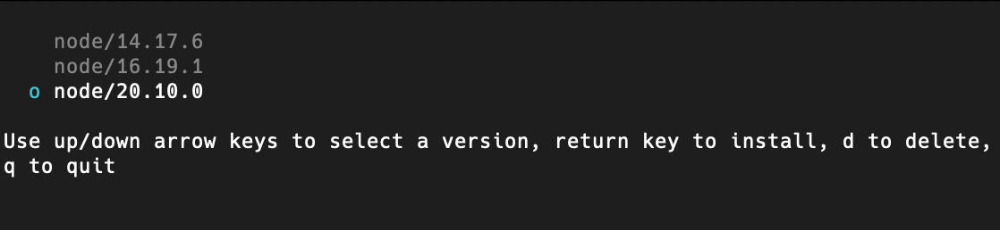


> 请使用 sudo 管理员权限，否则会遇到以下问题

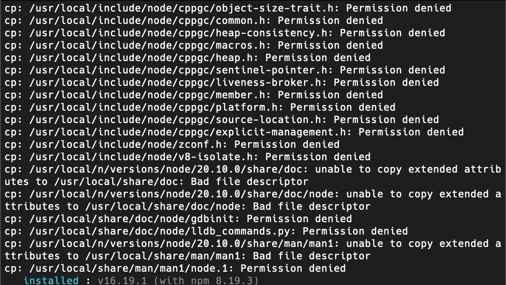

### 2. ant design pro

> macOS 需要使用 root 权限安装 ant-design-pro
>
> 如果下载慢使用 cnpm

```shell
# 使用 npm
npm i @ant-design/pro-cli -g
pro create myapp
```

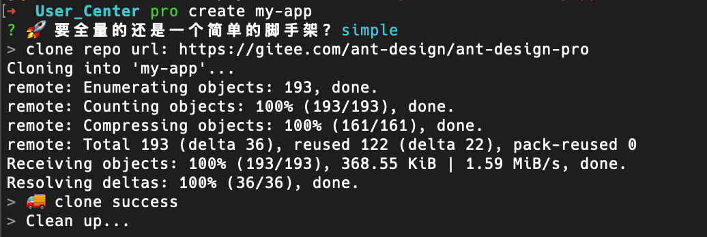

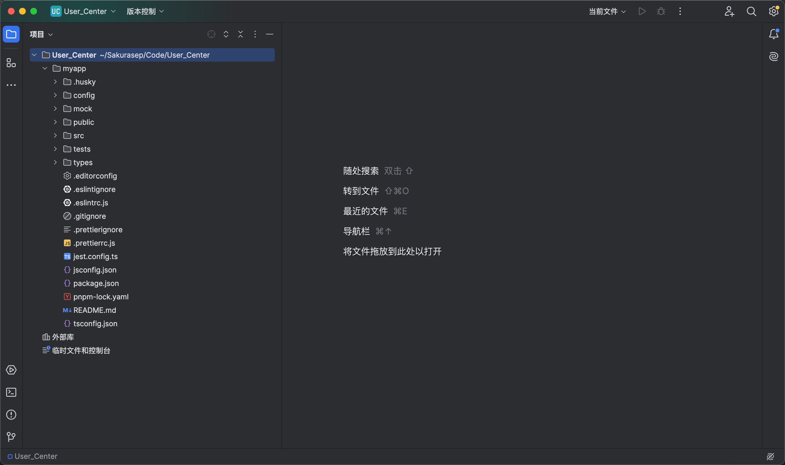

使用 yarn 安装项目依赖

```shell
yarn
```

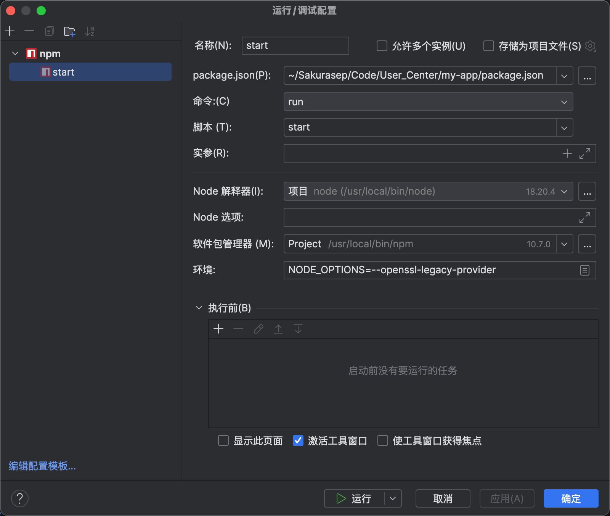

umi ui

```shell
yarn add @umijs/preset-ui -D
```

### 项目瘦身

移除国际化

locale: 国际化

swagger: 接口文档

tests: 测试


## 后端初始化

1. github 搜写好的代码
2. https://springinitializrjava8.cc/ 自动化模板

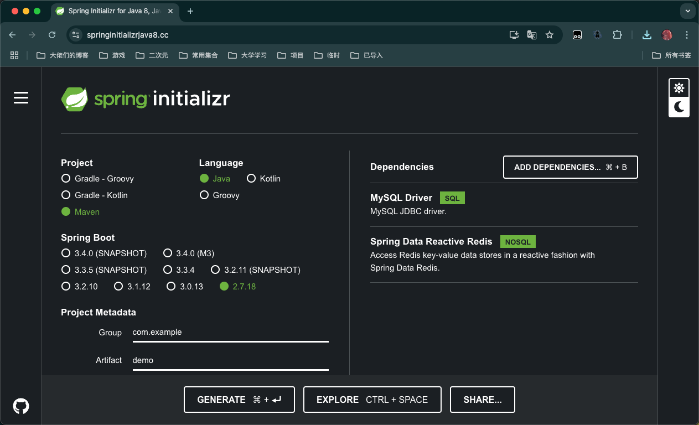

3. idea 自动生成

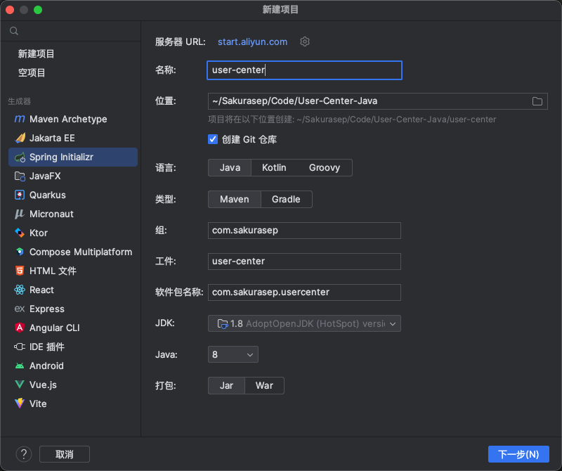

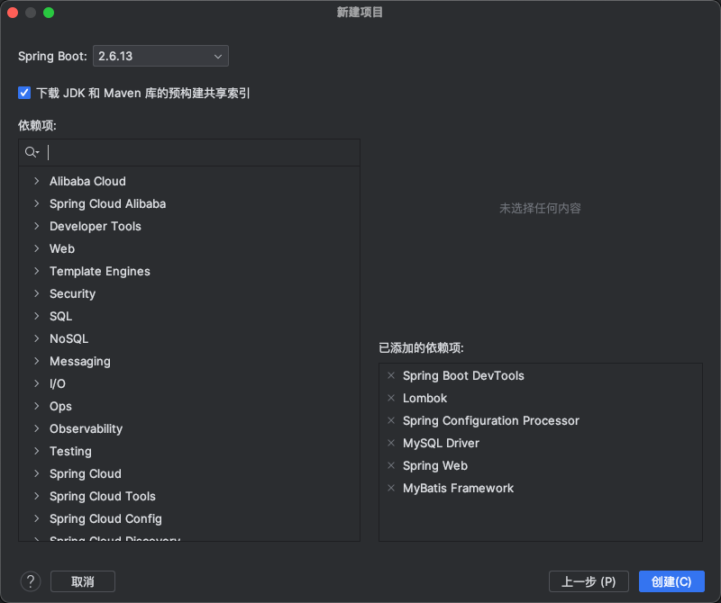

### mysql 测试连接

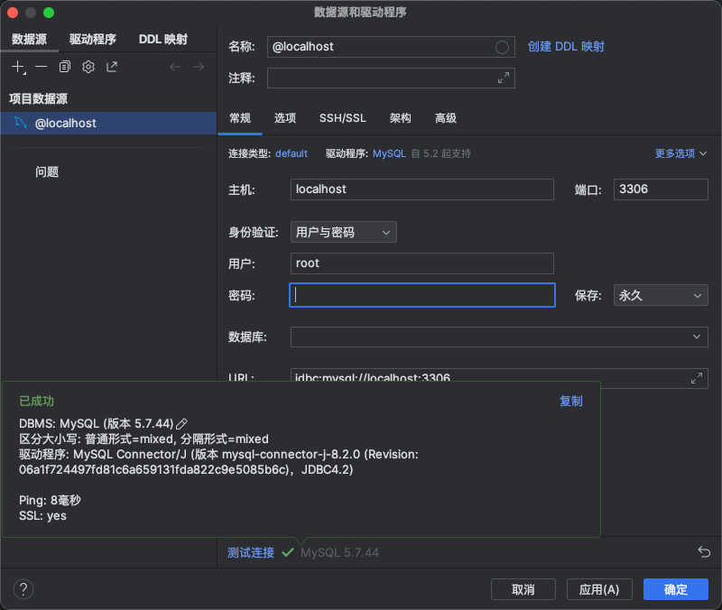

### maven 包

https://mvnrepository.com/

## 数据库设计

id username avatar gender password phone email isValid

```sql
create table user
(
    id           bigint auto_increment comment '主键',
    username     varchar(256)                        null comment '用户名',
    user_account varchar(256)                        null comment '账号',
    avatar       varchar(1024)                       null comment '头像',
    gender       tinyint                             null comment '性别',
    password     varchar(256)                        not null comment '密码',
    phone        varchar(256)                        null comment '手机号',
    email        varchar(512)                        null comment '邮箱',
    user_status  int                                 null comment '用户状态',
    create_time  datetime default CURRENT_TIMESTAMP not null comment '创建时间',
    update_time  datetime default CURRENT_TIMESTAMP not null comment '更新时间',
    primary key (id)
)
    comment '用户表';
```

### 目录分层

Controller: 请求层 控制层 接收请求 不做业务处理

Service: 业务逻辑

Mapper: 数据访问层

Model: 数据库相对应的模型 封装类

utils: 工具类

### 操作 user 表

1. 模型化 user 对象 自动生成与数据库相对应的内容

   使用 mybatisX 插件

   mybatisX可以自动帮我们根据数据库生成 domain 实体对象

   mapper 操作数据库的对象

   mapper.xml mapper对象与数据库的关联

   service 常用的增删改查

   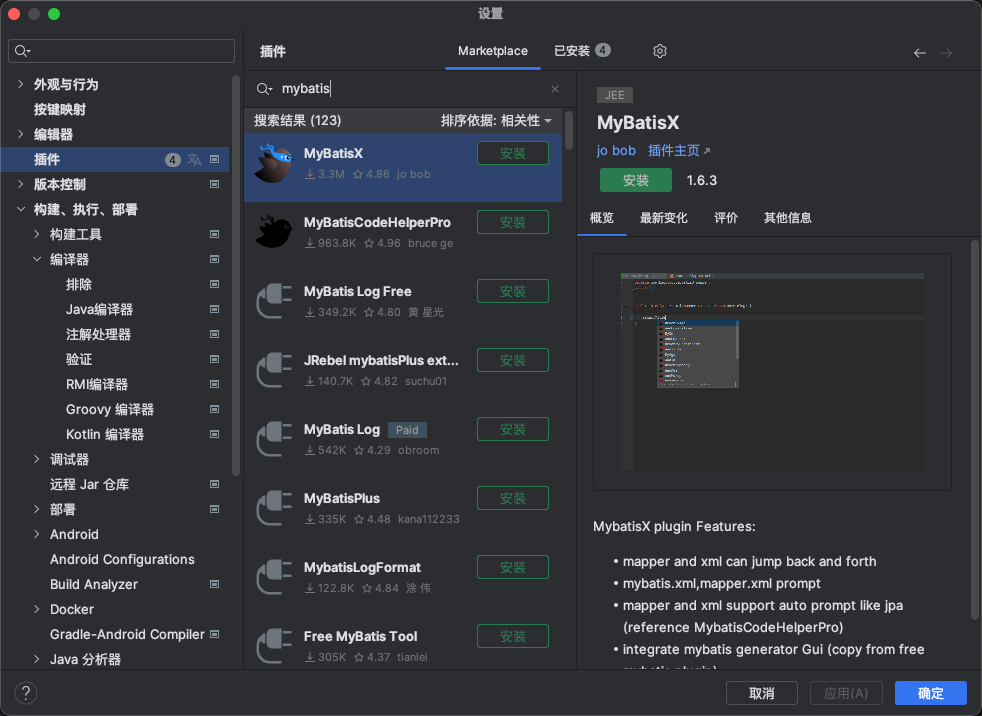

   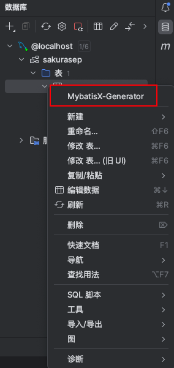
   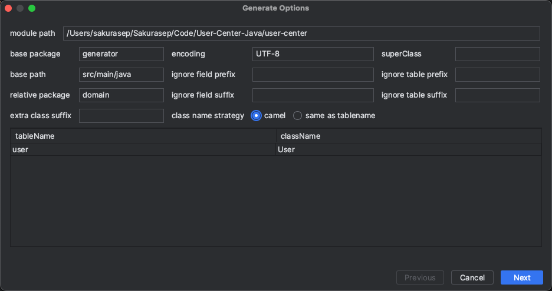

   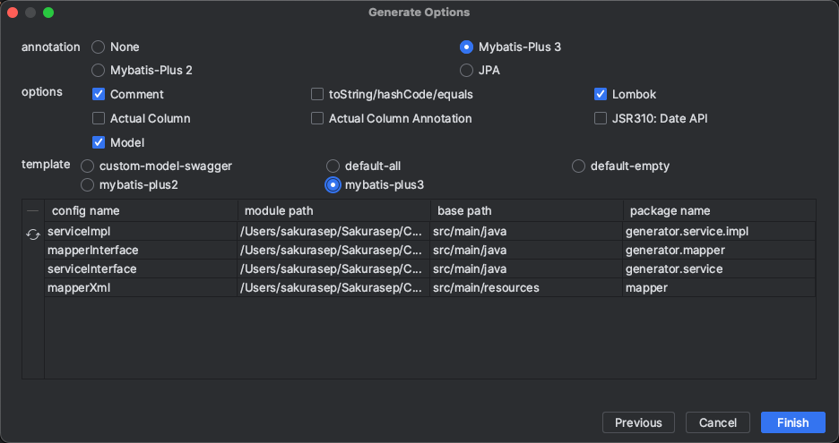

## 注册逻辑

1. 用户在前端输入账户密码，以及邀请码（非开放注册）
2. 校验账号密码是否符合要求 （用户名不小于 4 位 , 密码不小于 8 位， 密码强校验，正则表达式 ， 账户不能重复，并且不包含特殊字符， 密码与确认密码是否相同）
3. 对密码进行加密处理
4. 向数据库插入用户数据

## 登录逻辑

```
接收参数：用户账户，密码 
请求类型: POST 请求参数很长的时候不要GET
请求体：Json
返回值：用户信息 脱敏
校验逻辑: 
1. 校验用户账户和密码是否合法
	 1. 非空
	 2. 账户长度不小于 4 位
	 3. 密码不小于 8 位
	 4. 账户不包含特殊字符
2. 校验密码是否输入正确，要与数据库中的密文密码进行对比
3. 返回用户信息 脱敏
4. 记录用户的登录态，将其存到服务器上，用后端框架封装的服务器去保存 cookie
```

### 如何知道是哪一个用户成功登录

连接服务端后会得到一个 session1  状态，返回给前端。

登录成功后会获取一个 session2 状态，并且给这个呃 session 设置对应的用户信息，返回给前端一个设置 cookie 的命令

前端接受到后端的命令后，会设置一个 cookie，保存到浏览器内

前端再次请求后端的时候，需要在请求头中带上 cookie 去请求，后端根据获取到的 cookie，找到对应的 session2

后端从 session2 中取出根据这个 session2 存储的变量，也就是用户的登录信息


## 控制层 Controller 封装请求

```
@RestController 适用于编写 restful 风格的 api，返回值位 json 类型
```

controller 层倾向于对请求参数本身的校验，与业务逻辑无关

service 层是对业务逻辑的校验 因为 service 层会被 controller 层以外的类调用

## 用户管理接口

鉴权。防止被恶意调用

1. 查询用户
    1. 允许根据用户名查询
2. 删除用户
